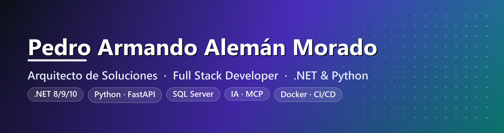

  

<h1 align="center">
  Hola 👋, soy Pedro Armando Alemán Morado
  
</h1>

<h3 align="center">🏗️ Arquitecto de Soluciones Hands-on · Full Stack Developer · .NET &amp; Python 🤖</h3>

  
  
  

## 🧑‍💻 Sobre mí

Arquitecto de Soluciones **hands-on** y desarrollador **Full Stack** con más de **22 años de experiencia** en SQL Server y sistemas empresariales. Especializado en plataformas **.NET**, arquitecturas **multitenant**, APIs, bases de datos, automatización e **integración de inteligencia artificial**.

Diseño soluciones de **extremo a extremo** — desde el modelo de negocio y de datos hasta la implementación, seguridad, despliegue y documentación técnica.

- 🏛️ **Programador de Sistemas** en la **Universidad Autónoma de Tamaulipas**
- 🚀 **Freelance & Arquitecto** en sectores de campañas políticas, salud, deportes y automatización
- 🗄️ **22+ años** diseñando y administrando **Microsoft SQL Server**
- 🤖 Integrando **LLMs, agentes IA y MCP** en el flujo de desarrollo diario
- 🌱 Siempre **aprendiendo cosas nuevas**
- 📫 Contáctame en **paleman79@gmail.com**

 

## 🛠️ Stack Tecnológico

### 💻 Lenguajes

### 🟣 Stack .NET

### 🗄️ Bases de Datos

-CC2927?style=for-the-badge&logo=microsoftsqlserver&logoColor=white)

### 🐍 Python / IA

### 🎨 Frontend

### ⚙️ DevOps / Infraestructura

-FCC624?style=for-the-badge&logo=linux&logoColor=black)

### 🧩 Arquitectura & Principios

## 🤖 IA, Agentes &amp; Metodologías

> Integro inteligencia artificial de forma **estructurada y medible** en el ciclo de desarrollo, con estándares compartidos entre proyectos.

| Área | Detalle |
|------|---------|
| 🧠 **LLMs** | ChatGPT · Claude · DeepSeek · GitHub Copilot Pro |
| 🔌 **MCP (Model Context Protocol)** | Conexión de agentes IA a **SQL Server en tiempo real**: consulta de tablas, stored procedures y esquemas |
| ⚡ **Claude Code** | Desarrollo *agentic*, **subagentes** y **skills** especializadas |
| 📄 **Archivos de contexto** | `CLAUDE.md` y `AGENTS.md` por proyecto |
| 📓 **NotebookLM** | Copiloto **arquitectónico** por proyecto |
| ✏️ **Napkin AI** | Generación de **diagramas** |
| 💰 **FinOps de IA** | Control de **consumo de tokens y costos** por módulo |
| 🏷️ **Clasificadores semánticos** | Bots **multitenant** con OpenAI y DeepSeek |
| 📐 **AI Engineering Standard** | Estándar de ingeniería de IA **compartido entre proyectos** |

## 🚀 Proyectos Destacados

| Proyecto | Descripción | Stack |
|----------|-------------|-------|
| 🗳️ **SmartPolV2** | Plataforma **multitenant** para campañas políticas y operación electoral. OCR de INE, prueba de vida activa y **99.6% de precisión** en validación de documentos | `ASP.NET Core 10` · `FastAPI` · `SQL Server` · `Docker` |
| ⚽ **Sportiva Live** | Administración de **torneos deportivos** con portal del delegado y notificaciones push | `.NET` · `PWA` · `Push` |
| 🏥 **UrbiMed** | Sistema de **administración médica** con generación de documentos | `.NET` · `QuestPDF` |
| 💬 **Urbi Flow / Urbi Bot Admin V2** | Plataforma de **bots multitenant** con integración de IA y registro de uso y costos | `.NET` · `IA` · `Multitenant` |
| 🧬 **SmartServicesAI** | Plataforma **FastAPI** de servicios IA: OCR, biometría y visión computacional, **sin persistencia** de datos biométricos | `FastAPI` · `OpenCV` · `MediaPipe` |

## 📚 Aprendiendo Actualmente

-4285F4?style=for-the-badge&logo=googlecloud&logoColor=white)

- ☁️ **Google Cloud** — preparación *Professional Cloud Architect*
- 🤖 **Desarrollo agentic avanzado** y orquestación de agentes
- 🧰 **Google Agent Development Kit (ADK)**
- 📊 **MLOps**, **BigQuery** y **Dataflow**
- 🧠 **Context Engineering**
- 🗂️ **GitHub Projects** para gestión de desarrollo

## 🏅 Formación &amp; Certificaciones

<table>
  <tr>
    <td align="center" width="33%">
      <b>Fundamentos de Azure</b> 
      
    </td>
    <td align="center" width="33%">
      <b>SQL Server 2005</b> 
      
    </td>
    <td align="center" width="33%">
      <b>.NET Framework 2.0 Web Applications</b> 
      
    </td>
  </tr>
</table>

📜 **Transcript completo de Microsoft Learn** →
[Ver certificaciones](https://learn.microsoft.com/es-mx/users/pedroalemnmorado-2485/transcript/d8y2jfp6mxollk0)

## 🔗 Conéctate conmigo

  
  
  
  
  
  

<i>💡 «Diseño soluciones de extremo a extremo: del modelo de negocio a la producción, con IA integrada de forma medible.»</i>

🗓️ Última actualización: Julio 2026

